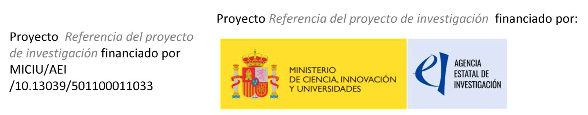
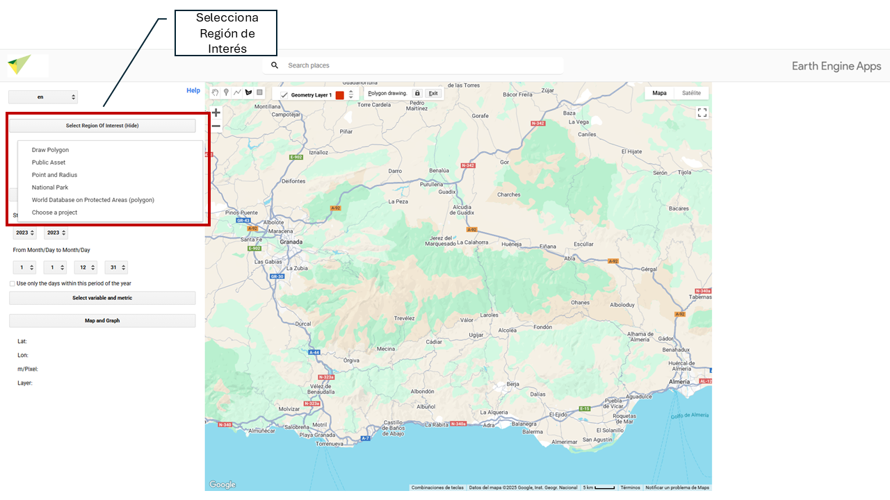
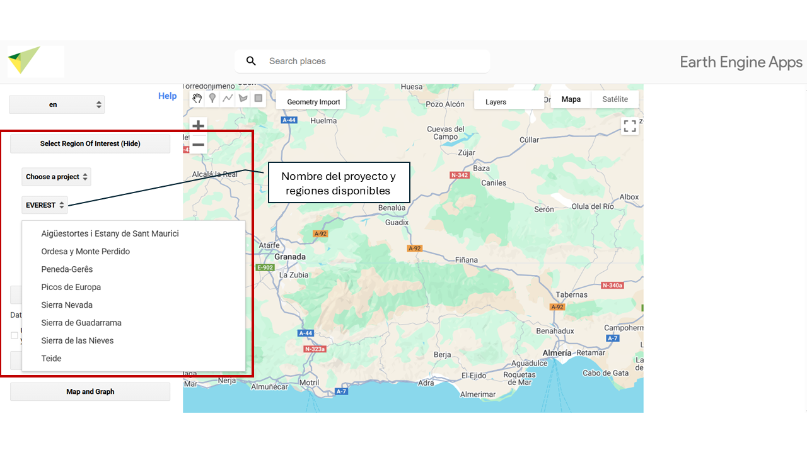

# Área de estudio {#area-estudio}

**Selecciona ROI– Elige tu área de estudio.** 

En esta sección puedes definir la **región de interés (ROI)** sobre la que se realizará el análisis. Tienes varias opciones disponibles para seleccionar o cargar tu área de estudio. 

## **🏞️ Parque Nacional EarthCul**

Puedes seleccionar como área de estudio cualquiera de los **Parques Nacionales de España y Portugal** disponibles en la plataforma.

## **📁 EarthCul**

Puedes seleccionar como área de estudio las zonas asociadas al proyecto:

* **EarthCul**: Áreas de influencia socioeconómica de los Parques Nacionales de montaña en España y Portugal.  

